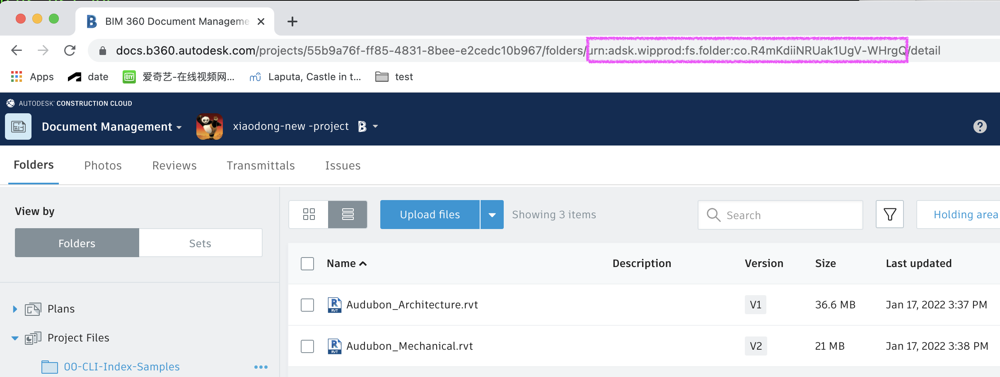

# Model Properties API Walkthrough in PowerShell Core

[](https://github.com/PowerShell/PowerShell)

[](https://forge.autodesk.com/en/docs/oauth/v2/overview/)
[](https://forge.autodesk.com/en/docs/data/v2/developers_guide/overview/)
[]( https://forge.autodesk.com/en/docs/acc/v1/overview/field-guide/model-properties/) 

[](http://opensource.org/licenses/MIT)
[](http://forge.autodesk.com/)

## Description

This repository demonstrates a set of samples and scripts which can be used to explore the [Autodesk Construction Cloud (ACC)](https://forge.autodesk.com/en/docs/acc/v1/overview/) **Model Properties service**. This API is also supported with [BIM360](https://forge.autodesk.com/en/docs/bim360/v1/overview/introduction/). This service allows callers to build and query indexes built from the BIM properties in models uploaded to ACC and BIM 360 Docs. The API also allows users to trigger the service to calculate changes (diffs) which have occurred between consecutive versions of a model. 

### Layout

This repository is comprised of the following top level folders.

 - [models](./models):  A set of sample RVT, DWG and IFC models which can be used with these samples, including two versions of same model (for testing diff properties)     
 - [scripts](./scripts): PowerShell demo scripts which can be used to build indexes and run queries
 - [src](./src) : A PowerShell script module providing cmdlets for building and querying indexes. Also including utility functions of Data Management API of Forge 
 - [doc](./doc): Additional documentations and snippets detailing the features of the indexing service

### Demonstrations

**In PowerShell Console**

   [](https://youtu.be/z0aL5xMbQP0 "Forge Model Differences in PowerShell Console")


**In VSCode**

   [](https://youtu.be/soya1pJ_W5o0 ""Model Properties API walkthrough in VSCode ")


### Prerequisites

1. **Knowledge of Model Properties API**: 
  Before getting started with the samples, you are encouraged to read the materials:
    - [indexing service field guide](https://forge.autodesk.com/en/docs/acc/v1/overview/field-guide/model-properties/): overview of Model Properties API 
    - [basic property indexing](https://forge.autodesk.com/en/docs/acc/v1/tutorials/model-properties/query/): step-by-step tutorial on how to run a query with schema of model properties
    - [using the indexing service to perform property diff queries](https://forge.autodesk.com/en/docs/acc/v1/tutorials/model-properties/diff/):step-by-step tutorial on how to check difference of model versions
    -  [indexing service query language reference](https://forge.autodesk.com/en/docs/acc/v1/tutorials/model-properties/query-ref/): document which will useful when extending the snippets provided in this repository to build your own index queries.
    - [index tables](./doc/examples/table.md):  document which describes how the JSON objects returned by the indexing service relate to the  managed by the service. Once you are familiar with how to map properties in the JSON object rows onto table _columns_ you can use the [query by example](./doc/examples/README.md) to learn the capabilities of the service's JSON query schema. 
 

2. **PowerShell Core**: All of the samples in this repository can be executed using Microsoft PowerShell Core. PowerShell Core is an open source, cross-platform .NET interactive command line shell. You can obtain the latest release version of this tool directly from the [PowerShell Core github repository](https://github.com/PowerShell/PowerShell), including binary installation packages for Windows, Ubuntu, Debian, CentOS, Red Hat Enterprise Linux, openSUSE, Fedora and macOS.

3. (Optional) **Visual Studio Code**: If you want to run the sample queries and scripts which use the PowerShell tools provided as part of this repo then it is useful to have a PowerShell capable IDE. Microsoft [Visual Studio Code](https://code.visualstudio.com/) is a great, free, cross-platform IDE with excellent PowerShell support. Microsoft also provides free [PowerShell Language Support for Visual Studio Code](https://github.com/PowerShell/vscode-powershell/blob/master/README.md) by way of an extension, available via the VSCode extension marketplace. Check out the [Using Visual Studio Code for PowerShell Development](https://docs.microsoft.com/en-us/powershell/scripting/dev-cross-plat/vscode/using-vscode?view=powershell-7.1) on MSDN for more information. All of the PowerShell code in this repo was developed using this extension!

4. **Forge Account**: Learn how to create a Forge Account, activate subscription and create an app by [this tutorial](http://learnforge.autodesk.io/#/account/). Get _Forge client id_, _Forge client secret_ and _Forge callback url_ (to get 3-legged token).  
 

5. **ACC or BIM360 account and project**: Grant your Forge client access to your account This documentation assumes that you have developer access to an ACC or BIM 360 project which you can use for testing purposes. If you do not yet have access to such a project contact you Autodesk administrator. It must be Account Admin to add the app integration. [Learn about provisioning](https://forge.autodesk.com/blog/bim-360-docs-provisioning-forge-apps). Make a note with the **account id** and  **project id**.  

### Running Locally

1.  Clone this sample project or download it. It's recommended to install [GitHub desktop](https://desktop.github.com/). To clone it via command line, use the following (**Terminal** on MacOSX/Linux, **Git Shell** on Windows):

    ```git clone https://github.com/Autodesk-Forge/forge-model-properties.powershell```

    This repo ships with a set of sample models at [models](./models) folder which illustrate the features of the indexing service. Make sure you have support for [git large file storage](https://git-lfs.github.com/). To check if your command line git client has lfs support available try the following at the command line. 

    ```PowerShell
    PS > git lfs --version
    ```

    If you do not have lfs installed this command will fail, otherwise you'll get to see version info which will look something like this.

    ```PowerShell
    PS > git lfs --version
    git-lfs/3.0.2 (GitHub; darwin amd64; go 1.17.2)
    ```

2. Upload sample models to your test project file folders of BIM360 or ACC. It is suggested to create a new folder when learning the API. Make a note with the **Folder Urn** (copy it from browser url). 

      <p align="center"></p> 

      All of the example queries in this repository have been tested against the models in [models](./models) folder . You could also adapt the examples in this repository to your own data, however if you want to contribute samples to this project you will need to test these against the sample models. 

3. Model Properties supports 3-legged token only. To get **3-legged token**, you could use web browser application such as [LearnForge ViewhubModel](https://learnforge.autodesk.io/#/tutorials/viewhubmodels), or utility such as [blazor web app](https://git.autodesk.com/whittld/WebAuth), or test tool such as Postman([one example](https://github.com/Autodesk-Forge/forge-autodesk.build.api-postman.collection/tree/main/Forms%20API)), or other scripts of utility. Make a note with the **3-legged token**

4. After the uploaded models have been proceessed in BIM360 or ACC, get **version urns** of some models. you could run [getUrns.ps1](scripts/getUrns.ps1) in [Demo Walkthough Scripts](scripts), or use other ways to get the model version urns.

      To run getUrns.ps1, input **project id (with b.)**, **folder urn** and **3-legged token**. It will dump the contents of the folder to a json file. In the json, copy out with some model version urns. If you work with Diff properties, copy two version urns of one model (in this sample, it provides two versions file: [Audubon_Mechanical.rvt v1](models/audubon/revit/v1/Audubon_Mechanical.rvt) and [Audubon_Mechanical.rvt v2](models/audubon/revit/v2/Audubon_Mechanical.rvt)

    <p align="center"></p> 

  The  [Upload Models and Get Urns Readme](models/Readme) is another reference that demos the workflow with more details

5. When model **version urns** are ready, you can use these to build and query indexes. In [Demo Walkthough Scripts](scripts), run the 4 utility tests one by one: 
    - createIndex.ps1: create index for some model versions and download fields, manifest and properties
    - runIndexQuery.ps1: basic query on the index above using specified parameters. download the properties
    - createDiffIndex.ps1: create diff index for two versions of one model and download fields, manifest and diff properties.
    - runDiffQuery.ps1: basic query on the diff index above using specified parameters. download the specific diff properties 

    Example of Index Properties
    <p align="center"></p> 
    
    Example of Diff Properties
    <p align="center"></p> 

    Check out [Scripts ReadMe](scripts/readme) for details. The scripts also uses cmdlets shipped as part of [ForgeCLI](./src/ForgeCLI.psd1). For full details of the cmdlets available in this script module see [README](./src/README.md) in the [src](./src).


### Additional Tests

After you are familar with the query schema, you could test with more complex schemas. Some advanced examples are available at [Query Examples](doc/examples/README.md).


## Further Reading

- [Model Properties API Endpoints](https://forge.autodesk.com/en/docs/acc/v1/reference/http/index-v2-index-fields-get/) API references of endpoints.
- [Data Management API](https://forge.autodesk.com/en/docs/data/v2/overview/)
API reference for Data Mangement API about hubs(accounts),projects, folders, model urns etc.
 

## License

This sample is licensed under the terms of the [MIT License](http://opensource.org/licenses/MIT). Please see the [LICENSE](./LICENSE.md) file for full details.

## Written by
-	[Don Whittle](https://www.linkedin.com/in/don-whittle-4869088), Model Coordination engineering team, Autodesk.
-	reviewed and edited by Xiaodong Liang [@coldwood](https://twitter.com/coldwood), [Forge Partner Development](http://forge.autodesk.com),Autodesk
